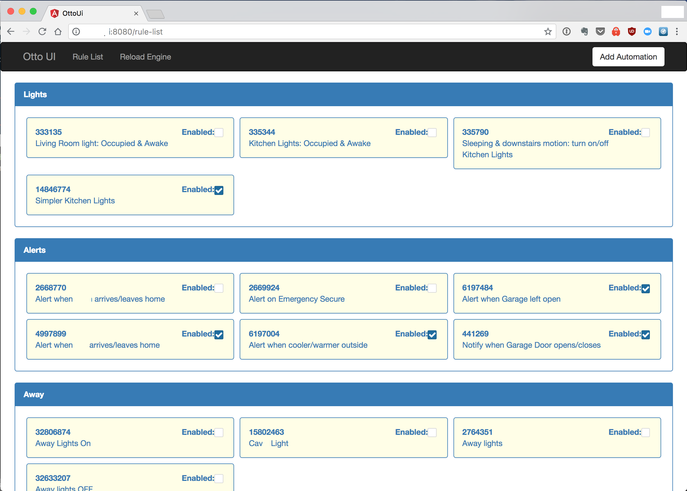

# `otto-ui` [](https://travis-ci.org/sheaffej/otto-ui)

An Angular 6 built UI for the [`otto-engine`](https://github.com/sheaffej/otto-engine) rule automation engine.



To run unit tests locally using HeadlessChrome

```
$ scripts/run_tests.sh
```